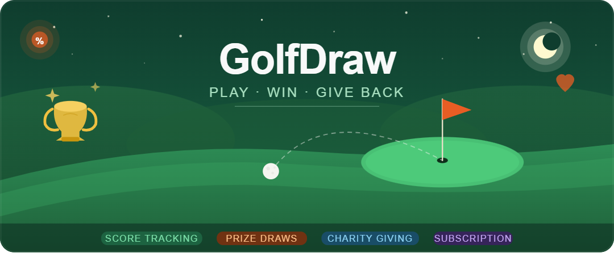

<div align="center">

**Play · Win · Give Back**

A subscription-based golf platform combining score tracking,
monthly prize draws, and charitable giving.

[](https://nextjs.org)
[](https://typescriptlang.org)
[](https://supabase.com)
[](https://razorpay.com)
[](https://vercel.com)
[](https://tailwindcss.com)

---

[🚀 Live Demo](#-live-demo) · [📖 Docs](#-getting-started) · [🐛 Report Bug](https://github.com/your-org/golfdraw/issues) · [✨ Request Feature](https://github.com/your-org/golfdraw/issues)

</div>

---

## 📋 Table of contents

- [Overview](#-overview)
- [Live demo](#-live-demo)
- [Features](#-features)
- [Tech stack](#-tech-stack)
- [Architecture](#-architecture)
- [Project structure](#-project-structure)
- [Database schema](#-database-schema)
- [User flows](#-user-flows)
- [Getting started](#-getting-started)
- [Environment variables](#-environment-variables)
- [Database setup](#-database-setup)
- [Razorpay setup](#-razorpay-setup)
- [Admin access](#-admin-access)
- [Draw engine](#-draw-engine)
- [Deployment](#-deployment)
- [Loading states](#-loading-states)
- [Roadmap](#-roadmap)
- [Contributing](#-contributing)
- [License](#-license)

---

## 🌟 Overview

GolfDraw lets golfers subscribe monthly or yearly, track their last 5 golf scores, and get automatically entered into a monthly prize draw. A portion of every subscription goes to a charity of the member's choice. Winners upload a scorecard screenshot for verification before prizes are paid out.

The platform serves three distinct audiences:

| Audience         | Role                                                                  |
| ---------------- | --------------------------------------------------------------------- |
| 🏌️ **Members**   | Subscribe, submit scores, watch the jackpot grow, claim prizes        |
| 🛠️ **Admins**    | Configure and publish monthly draws, verify winners, manage charities |
| 💚 **Charities** | Receive a portion of subscription revenue automatically every month   |

---

## 🚀 Live demo

| Environment    | URL                                             | Status                                                                          |
| -------------- | ----------------------------------------------- | ------------------------------------------------------------------------------- |
| 🌐 Production  | `https://golf-draw-4yoz.vercel.app/`            |  |
| 🔐 Admin login | `https://golf-draw-4yoz.vercel.app/admin/login` |  |

---

## ✨ Features

### 👤 Member features

| Feature              | Description                                                         |
| -------------------- | ------------------------------------------------------------------- |
| 💳 Subscription      | Monthly (£9/mo) or yearly (£86/yr) plans via Razorpay               |
| 🏌️ Score tracking    | Submit scores 1–45, rolling window of last 5 retained automatically |
| 🎟️ Auto draw entry   | All active subscribers entered each month automatically             |
| 💚 Charity giving    | Choose 10%, 15%, or 30% of subscription to donate                   |
| 🏢 Charity selection | Pick from a curated directory of 12+ verified charities             |
| 📊 Draw history      | Full history of every draw entered and match results                |
| 🏆 Winner portal     | Upload scorecard proof to claim prizes securely                     |
| 📱 User dashboard    | Overview of scores, draws, charity, and subscription status         |

### 🛠️ Admin features

| Feature                | Description                                                |
| ---------------------- | ---------------------------------------------------------- |
| ⚙️ Draw configuration  | Set mode, month, prize pool, and draw number               |
| 🔍 Simulation mode     | Preview results before committing — nothing is saved       |
| 📢 Publish draws       | Lock results, notify winners, trigger jackpot rollover     |
| ✅ Winner verification | Review scorecard uploads, approve or reject with notes     |
| 👥 User management     | Search, filter, view all members, cancel subscriptions     |
| 🏢 Charity management  | Add, edit, activate and deactivate charities               |
| 📈 Analytics           | MRR, charity totals, subscription trends, draw history     |
| 🔐 Admin login         | Separate `/admin/login` with role-based JWT access control |

### 🎯 Draw prize structure

| Category           | Pool share |               Rollover                |
| ------------------ | :--------: | :-----------------------------------: |
| 🥇 5-match jackpot |  **40%**   | ✅ Yes — carries forward if unclaimed |
| 🥈 4-match prize   |  **35%**   |                 ❌ No                 |
| 🥉 3-match prize   |  **25%**   |                 ❌ No                 |

> Two draw modes: **Random** (equal odds, cryptographic RNG) and **Algorithmic** (score-weighted bias toward members whose average is closest to the draw number).

---

## 🛠️ Tech stack

| Layer             | Technology               | Purpose                     |
| ----------------- | ------------------------ | --------------------------- |
| **Framework**     | Next.js 14               | App Router, SSR, API routes |
| **Language**      | TypeScript               | Strict mode throughout      |
| **Styling**       | Tailwind CSS + shadcn/ui | Utility-first CSS           |
| **Design**        | Neumorphic               | DM Serif Display + DM Sans  |
| **Database**      | Supabase                 | PostgreSQL + RLS + Storage  |
| **Auth**          | Supabase Auth            | JWT, role-based access      |
| **Payments**      | Razorpay                 | Subscriptions + webhooks    |
| **Email**         | Resend                   | Transactional emails        |
| **Jobs**          | pg_cron                  | Monthly draw scheduler      |
| **Data fetching** | TanStack Query           | Server state management     |
| **Forms**         | react-hook-form + zod    | Validation                  |
| **Charts**        | Recharts                 | Analytics visualisations    |
| **Progress**      | nprogress                | Route transition loader     |
| **Toasts**        | sonner                   | Notifications               |
| **Deployment**    | Vercel                   | Edge deployment + CDN       |

---

## 🏗️ Architecture

```
┌─────────────────────────────────────────────────────────────┐
│                    Client (Next.js 14 PWA)                  │
│         User dashboard · Admin dashboard · Marketing        │
└───────────────────────────┬─────────────────────────────────┘
                            │ HTTPS / REST
┌───────────────────────────▼─────────────────────────────────┐
│                   Next.js API routes                        │
│          Auth middleware · Rate limiting · Routing          │
└──────┬──────────┬──────────┬──────────┬────────────────────┘
       │          │          │          │
       ▼          ▼          ▼          ▼
    Auth      Subscription  Scores   Draw engine
    module      module      module   (pure fn)
                                          │
                         ┌────────────────▼───────────────┐
                         │    Supabase (Postgres + RLS)    │
                         │  Auth · Storage · Realtime      │
                         └────────┬───────────────────────┘
                                  │
               ┌──────────────────┼──────────────────┐
               ▼                  ▼                   ▼
           Razorpay             Resend             pg_cron
          (payments)            (email)           (scheduler)
```

> 💡 **Key design decision:** The draw engine is a pure function with zero side effects — safe to call during simulation and then again identically during publish. Same seed always produces the same result.

---

## 📁 Project structure

```
golfdraw/
│
├── 📂 app/
│   ├── (auth)/
│   │   ├── login/                    # Member login
│   │   ├── register/                 # Step 1 — account creation
│   │   ├── register/charity/         # Step 2 — charity % picker (10/15/30)
│   │   ├── register/plan/            # Step 3 — plan + Razorpay checkout
│   │   └── forgot-password/
│   │
│   ├── (user)/
│   │   ├── dashboard/                # Member overview
│   │   ├── scores/                   # Score submission + history
│   │   ├── charity/                  # Charity selection + contribution %
│   │   ├── draws/                    # Draw history + winnings
│   │   ├── draws/verify/[id]/        # Winner proof upload portal
│   │   └── account/                  # Subscription + billing
│   │
│   ├── admin/
│   │   └── login/                    # Admin-only login (isolated)
│   │
│   ├── (admin)/
│   │   ├── admin/                    # Analytics overview
│   │   ├── admin/users/              # User management table
│   │   ├── admin/draws/              # Draw list + configuration
│   │   ├── admin/draws/[id]/         # Draw detail + simulate + publish
│   │   ├── admin/winners/            # Winner verification queue
│   │   └── admin/charities/          # Charity directory management
│   │
│   └── api/
│       ├── auth/register/
│       ├── users/                    # profile · charity · me
│       ├── charities/
│       ├── scores/
│       ├── subscriptions/            # create · verify · cancel
│       ├── draws/                    # configure · simulate · publish · trigger
│       ├── winners/                  # upload-url · confirm-upload
│       ├── admin/                    # analytics · users · draws · charities
│       │                             # verifications · auth/login
│       ├── email/                    # welcome · draw-winner · rejection
│       │                             # payment-confirmed
│       └── webhooks/razorpay/
│
├── 📂 components/
│   ├── ui/                           # Skeleton · LoadingButton · TopLoader
│   ├── subscription/                 # SubscriptionCard · StatusBadge
│   ├── scores/                       # ScoreInput · ScoreHistory · ScoreSummary
│   ├── draw/                         # DrawCard · MatchBadge · WinningsWidget
│   ├── charity/                      # CharityCard · CharityManager · CharityWidget
│   ├── winners/                      # WinnerUploadForm
│   ├── dashboard/                    # QuickActions · DashboardSkeleton
│   └── admin/
│       ├── AdminLoginForm
│       ├── UserTable · UserDetailPanel
│       ├── DrawConfigForm · DrawSimulationPreview · DrawPublishConfirm
│       ├── VerificationQueue · ProofViewer · RejectModal
│       ├── CharityTable · CharityForm
│       └── analytics/                # StatCards · SubscriptionChart · DrawHistoryTable
│
├── 📂 lib/
│   ├── supabase/                     # client · server · middleware
│   ├── razorpay/                     # client · verify (HMAC)
│   ├── draw/                         # engine · random · matcher
│   │                                 # prizes · algorithm · snapshot
│   │                                 # __tests__/engine.test.ts
│   ├── auth/                         # requireAdmin · adminLoginLimiter
│   ├── email/                        # templates
│   └── types/                        # draw · score · charity · verification
│
├── 📂 supabase/
│   ├── migrations/
│   │   ├── 001_initial_schema.sql
│   │   ├── 002_rls_policies.sql
│   │   ├── 003_score_trigger.sql
│   │   ├── 004_pg_cron_draw.sql
│   │   └── 005_winner_storage.sql
│   └── seed.sql
│
├── 📂 scripts/
│   └── make-admin.ts                 # Grant admin role to a user
│
├── middleware.ts                     # Route protection for all routes
├── .env.example
└── next.config.ts
```

---

## 🗄️ Database schema

```
┌──────────────────────────────────────────────────────────────┐
│  users                                                        │
├─────────────────────────────┬────────────────────────────────┤
│ id                          │ uuid  PK                        │
│ email                       │ text  unique not null           │
│ full_name                   │ text                            │
│ subscription_status         │ active|inactive|cancelled|past_due│
│ charity_id                  │ uuid  FK → charities (nullable) │
│ charity_contribution_pct    │ int   0 | 10 | 15 | 30          │
│ razorpay_customer_id        │ text                            │
└──────────────────────────────────────────────────────────────┘

┌──────────────────────────────────────────────────────────────┐
│  subscriptions                                                │
├─────────────────────────────┬────────────────────────────────┤
│ id                          │ uuid  PK                        │
│ user_id                     │ uuid  FK → users                │
│ razorpay_subscription_id    │ text  unique                    │
│ plan_type                   │ monthly | yearly                │
│ status                      │ active|past_due|inactive|cancelled│
│ current_period_end          │ timestamptz                     │
└──────────────────────────────────────────────────────────────┘

┌──────────────────────────────────────────────────────────────┐
│  scores                                        ⚡ trigger    │
├─────────────────────────────┬────────────────────────────────┤
│ id                          │ uuid  PK                        │
│ user_id                     │ uuid  FK → users                │
│ value                       │ int   CHECK (1 ≤ value ≤ 45)    │
│ submitted_at                │ timestamptz                     │
└──────────────────────────────────────────────────────────────┘
  ⚡ Postgres trigger: enforce_score_limit()
     Automatically deletes oldest score when count > 5 per user

┌──────────────────────────────────────────────────────────────┐
│  draws                                                        │
├─────────────────────────────┬────────────────────────────────┤
│ id                          │ uuid  PK                        │
│ month                       │ text  e.g. '2025-04'            │
│ mode                        │ random | algorithmic            │
│ status                      │ draft | simulated | published   │
│ prize_pool_total            │ numeric                         │
│ draw_number                 │ int   1–45                      │
│ seed                        │ text  UUID for audit trail      │
│ config                      │ jsonb eligible_users + rollover │
│ executed_at                 │ timestamptz                     │
└──────────────────────────────────────────────────────────────┘

┌──────────────────────────────────────────────────────────────┐
│  draw_results                                                 │
├─────────────────────────────┬────────────────────────────────┤
│ id                          │ uuid  PK                        │
│ draw_id                     │ uuid  FK → draws                │
│ user_id                     │ uuid  FK → users                │
│ match_category              │ 3-match | 4-match | 5-match     │
│ prize_amount                │ numeric  per-winner share       │
│ payment_status              │ pending|approved|paid|rejected  │
└──────────────────────────────────────────────────────────────┘

┌──────────────────────────────────────────────────────────────┐
│  winner_verifications                                         │
├─────────────────────────────┬────────────────────────────────┤
│ id                          │ uuid  PK                        │
│ draw_result_id              │ uuid  FK → draw_results         │
│ proof_url                   │ text  Supabase Storage path     │
│ status                      │ pending | approved | rejected   │
│ rejection_note              │ text                            │
│ reviewed_by                 │ uuid  FK → users (admin)        │
│ reviewed_at                 │ timestamptz                     │
└──────────────────────────────────────────────────────────────┘

┌──────────────────────────────────────────────────────────────┐
│  prize_pool_ledger                              📝 append-only│
├─────────────────────────────┬────────────────────────────────┤
│ id                          │ uuid  PK                        │
│ subscription_id             │ uuid  FK → subscriptions        │
│ amount                      │ numeric                         │
│ type                        │ contribution | rollover | payout│
│ period                      │ text  e.g. '2025-04'            │
└──────────────────────────────────────────────────────────────┘
```

> 🔒 **All tables have Row Level Security (RLS) enabled.** Users can only access their own data. Admin operations use the Supabase service role key server-side.

---

## 🔄 User flows

### Member onboarding

```
🌐  / (landing page)
     │
     └──▶  🔐 /login
               │
               ├── Active subscriber ──────────────────────▶  📊 /dashboard
               │
               └── New user ──▶  📝 /register
                                      │
                                      └──▶  💚 /register/charity
                                                 Pick: 10% / 15% / 30%
                                                 or Skip (0%)
                                                 │
                                                 └──▶  💳 /register/plan
                                                            Monthly £9
                                                            Yearly £86
                                                            Shows split
                                                            │
                                                            └──▶  💰 Razorpay
                                                                       Webhook
                                                                       status=active
                                                                       │
                                                                       └──▶  📊 /dashboard
```

### Monthly draw lifecycle

```
🕘  1st of month · 09:00 UTC
     pg_cron fires POST /api/draws/trigger
     └──▶  Draft draw created (draw_number + seed generated)

🔐  Admin logs in at /admin/login
     │
     ├──  ⚙️  Reviews configuration
     │         mode · prize pool · eligible user count
     │
     ├──  🔍  Simulates draw
     │         Engine runs — pure fn, nothing saved
     │         Preview: X winners · jackpot status · prize per winner
     │
     └──  📢  Publishes draw → types "PUBLISH" to confirm
               │
               ├──  draw_results rows written to DB
               ├──  Winners notified by email
               └──  No 5-match → jackpot rolls to next month

🏆  Winner receives email
     └──▶  /draws/verify/[id]
               │
               ├──  Uploads scorecard screenshot
               │    (direct to Supabase Storage, server never sees file)
               │
               └──  Admin reviews in /admin/winners
                         │
                         ├──  ✅ Approve  →  payment_status: approved → paid
                         └──  ❌ Reject   →  winner notified, can re-upload
```

### Prize pool breakdown

```
Monthly subscription — £9

  Choice      Charity     Prize pool
  ──────────────────────────────────
  Skip (0%)   £0.00  →   £9.00
  10%         £0.90  →   £8.10
  15%         £1.35  →   £7.65
  30%         £2.70  →   £6.30

Prize pool split each month:
  ████████████████  40% → 5-match jackpot  (rolls over if no winner)
  ██████████████    35% → 4-match prize    (split equally among winners)
  ██████████        25% → 3-match prize    (split equally among winners)
```

---

## 🚀 Getting started

### Prerequisites

- Node.js 18+
- [Supabase](https://supabase.com) project (free tier works)
- [Razorpay](https://razorpay.com) account
- [Resend](https://resend.com) account

### Installation

```bash
# 1. Clone the repository
git clone https://github.com/your-org/golfdraw.git
cd golfdraw

# 2. Install dependencies
npm install

# 3. Set up environment variables
cp .env.example .env.local
# Fill in all values — see Environment variables section

# 4. Apply database migrations
npx supabase db push

# 5. Seed the charity directory
# Run supabase/seed.sql in the Supabase SQL Editor
# OR reset everything at once:
npx supabase db reset

# 6. Start the development server
npm run dev
```

App runs at **http://localhost:3000** 🎉

### Razorpay webhooks (local dev)

```bash
# Expose localhost
npx ngrok http 3000

# Add URL to Razorpay Dashboard → Settings → Webhooks:
# https://your-id.ngrok.io/api/webhooks/razorpay

# Enable these events:
#   ✓ subscription.activated
#   ✓ subscription.charged
#   ✓ subscription.cancelled
#   ✓ subscription.halted
#   ✓ payment.failed

# Copy the webhook secret → RAZORPAY_WEBHOOK_SECRET in .env.local
```

---

## 🔑 Environment variables

```bash
# ── Supabase ─────────────────────────────────────────────────
NEXT_PUBLIC_SUPABASE_URL=https://your-project.supabase.co
NEXT_PUBLIC_SUPABASE_ANON_KEY=your-anon-key
SUPABASE_SERVICE_ROLE_KEY=your-service-role-key

# ── Razorpay ─────────────────────────────────────────────────
NEXT_PUBLIC_RAZORPAY_KEY_ID=rzp_test_...
RAZORPAY_KEY_SECRET=your-secret-key
RAZORPAY_WEBHOOK_SECRET=your-webhook-secret
RAZORPAY_MONTHLY_PLAN_ID=plan_...
RAZORPAY_YEARLY_PLAN_ID=plan_...

# ── Resend ───────────────────────────────────────────────────
RESEND_API_KEY=re_...
EMAIL_FROM=noreply@golfdraw.com

# ── App ──────────────────────────────────────────────────────
NEXT_PUBLIC_APP_URL=https://golfdraw.vercel.app
INTERNAL_SECRET=a-long-random-string-for-pg-cron-trigger
```

> ⚠️ **All variables are required.** The build will fail if any are missing.

---

## 🗄️ Database setup

### Run migrations

```bash
# Recommended — Supabase CLI
npx supabase db push

# Manual — run each file in Supabase SQL Editor in order
# 001 → 002 → 003 → 004 → 005
```

### Migration overview

| File                     | Purpose                                    |
| ------------------------ | ------------------------------------------ |
| `001_initial_schema.sql` | Creates all 8 core tables with constraints |
| `002_rls_policies.sql`   | Enables RLS and all access policies        |
| `003_score_trigger.sql`  | Rolling 5-score window Postgres trigger    |
| `004_pg_cron_draw.sql`   | Monthly draw scheduler (1st, 09:00 UTC)    |
| `005_winner_storage.sql` | Private storage bucket + upload policies   |

### Seed charities

The seed file inserts **12 charities** across 4 categories:

| Category             | Charities                                                                     |
| -------------------- | ----------------------------------------------------------------------------- |
| ⛳ Golf & Sport      | St Andrews Links Trust · Golf Foundation · The R&A Foundation                 |
| 🏥 Health & Research | Alzheimer's Research UK · British Heart Foundation · Macmillan Cancer Support |
| 🎓 Youth & Education | Youth Sport Trust · Street League · StreetGames                               |
| 🌿 Environment       | The Wildlife Trusts · Woodland Trust · Golf Environment Organisation          |

### Configure pg_cron (production)

Run once in Supabase SQL Editor after deploying:

```sql
ALTER DATABASE postgres
  SET app.url = 'https://your-app.vercel.app';

ALTER DATABASE postgres
  SET app.internal_secret = 'your-INTERNAL_SECRET-value';
```

---

## 💳 Razorpay setup

### Create subscription plans

In Razorpay Dashboard → Products → Subscriptions → Plans:

| Plan    | Period  | Amount              | Env var                    |
| ------- | ------- | ------------------- | -------------------------- |
| Monthly | monthly | 900 paise (£9.00)   | `RAZORPAY_MONTHLY_PLAN_ID` |
| Yearly  | yearly  | 8600 paise (£86.00) | `RAZORPAY_YEARLY_PLAN_ID`  |

### Webhook events

```
URL: https://yourdomain.com/api/webhooks/razorpay

✓ subscription.activated   →  status: active, write ledger entry
✓ subscription.charged     →  renew period_end, write ledger entry
✓ subscription.cancelled   →  status: cancelled
✓ subscription.halted      →  status: inactive (payment failed)
✓ payment.failed           →  status: past_due
```

### Webhook verification

```ts
// ⚠️ Always verify before processing
const body = await req.text(); // raw body — parse AFTER
const signature = req.headers.get('x-razorpay-signature');
const expected = crypto
  .createHmac('sha256', process.env.RAZORPAY_WEBHOOK_SECRET!)
  .update(body)
  .digest('hex');

if (signature !== expected) {
  return new Response('Unauthorized', { status: 400 });
}

// ⚡ Return 200 immediately to prevent duplicate retries
return new Response('OK', { status: 200 });
```

---

## 🔐 Admin access

> The admin dashboard lives at `/admin`. The **only** entry point is `/admin/login`. Regular member accounts are rejected even with valid credentials.

### Grant admin role

**Step 1** — Register normally at `/register` with your admin email.

**Step 2** — Run the make-admin script:

```bash
npx ts-node scripts/make-admin.ts your-admin@email.com

# Output:
# ✓ your-admin@email.com is now an admin
#   User ID: abc-123-...
#   Login at: /admin/login
```

Or in Supabase SQL Editor:

```sql
UPDATE auth.users
SET raw_app_meta_data =
  raw_app_meta_data || '{"role": "admin"}'::jsonb
WHERE email = 'your-admin@email.com';
```

**Step 3** — Visit `/admin/login` and sign in.

### Security model

```
POST /api/admin/auth/login
  ├── ⏱️  Rate limit: 5 attempts / 15 min / email
  ├── 🔑  supabase.auth.signInWithPassword()
  ├── 🔍  Check app_metadata.role === 'admin'
  ├── ❌  Not admin → signOut() immediately → 403
  └── ✅  Admin confirmed → session set → redirect /admin

/admin/* routes (server-side, every request)
  ├── No session    →  redirect /admin/login
  ├── Not admin     →  redirect /admin/login?error=access_denied
  └── ✅ Confirmed  →  render page

/api/admin/* routes
  ├── No session  →  401 Unauthorized
  ├── Not admin   →  403 Forbidden
  └── ✅ Admin    →  proceed
```

---

## ⚙️ Draw engine

The draw engine (`lib/draw/engine.ts`) is a **pure TypeScript function** — no DB calls, no side effects, fully synchronous. Same seed + same snapshot = identical result every time.

### How matching works

```
Draw number:   32
────────────────────────────────────────────────
User A: [32, 28, 32, 35, 32]  →  3 matches  →  🥉 3-match winner
User B: [32, 32, 32, 32, 28]  →  4 matches  →  🥈 4-match winner
User C: [32, 32, 32, 32, 32]  →  5 matches  →  🥇 5-match JACKPOT
User D: [28, 30, 35, 27, 29]  →  0 matches  →  No prize
────────────────────────────────────────────────
Prize = category pool ÷ number of winners in category
```

### Jackpot rollover example

```
April draw:   No 5-match winner
              → £1,680 jackpot written to prize_pool_ledger (type: rollover)

May draw:     getRolloverAmount() reads £1,680
              → Jackpot bucket: £1,680 (new) + £1,680 (rollover) = £3,360

June draw:    Someone hits 5-match!
              → £3,360 + £1,680 = £5,040 jackpot claimed  🎉
```

### Draw modes

| Mode               | Description                                                                                     |
| ------------------ | ----------------------------------------------------------------------------------------------- |
| 🎲 **Random**      | `crypto.randomInt(1, 46)` — cryptographically secure, equal odds for all, seed stored for audit |
| 🧮 **Algorithmic** | Same RNG + hot-zone bias: 30% chance to re-roll toward the top 5 most common member scores      |

### Run the tests

```bash
npx vitest run lib/draw/__tests__/engine.test.ts

# Tests cover:
#   countMatches · getMatchCategory · splitPrize
#   calculatePrizeBuckets · runDrawEngine (full integration)
#   Jackpot rollover logic · deterministic output with same seed
```

---

## 🚢 Deployment

### Deploy to Vercel

```bash
npm i -g vercel
vercel --prod
```

Set all environment variables in **Vercel Project → Settings → Environment Variables**.

### Fix lint errors before deploying

```bash
# Fix all Prettier formatting errors automatically
npx prettier --write .

# Fix auto-fixable ESLint errors
npx eslint . --fix

# Commit and push
git add . && git commit -m "fix: formatting and lint" && git push
```

If you need a fast deploy and will fix later:

```ts
// next.config.ts — remove once errors are fixed
const nextConfig = {
  eslint: { ignoreDuringBuilds: true },
  typescript: { ignoreBuildErrors: true },
};
```

### ✅ Production checklist

```
□ All environment variables set in Vercel dashboard
□ Supabase migrations applied to production database
□ seed.sql applied — charity directory populated
□ pg_cron app.url and app.internal_secret configured
□ Razorpay webhook URL updated to production domain
□ Razorpay LIVE keys used (rzp_live_ not rzp_test_)
□ Admin account created and make-admin.ts script run
□ winner-proofs storage bucket confirmed PRIVATE
□ Resend domain verified (DNS records added)
□ Full member flow tested: register → subscribe → score → draw → verify
□ Full admin flow tested: login → configure → simulate → publish
□ Winner verification flow tested: upload → approve → paid
```

---

## ⏳ Loading states

Three levels of loading feedback throughout:

| Level                    | Implementation                    | Where                    |
| ------------------------ | --------------------------------- | ------------------------ |
| 🔵 **Route transitions** | `nprogress` green progress bar    | Every navigation         |
| 🟡 **Page skeletons**    | `loading.tsx` neumorphic skeleton | Every route              |
| 🟢 **Action spinners**   | `LoadingButton` component         | Every API-calling button |

---

## 🗺️ Roadmap

- [ ] 🧮 Algorithmic draw — fully weighted member selection
- [ ] 💸 Automated payouts via Razorpay Payouts API (post-KYC)
- [ ] 📱 React Native mobile app sharing `lib/` business logic
- [ ] 🌍 Multi-country support — localised plans and currencies
- [ ] 🌐 Public draw results page — shareable, no login required
- [ ] 🎁 Referral programme — invite codes with prize pool bonus
- [ ] 🏆 Leaderboard — all-time winnings, win rate, draws entered
- [ ] ⛳ Score import — Golf England handicap API integration
- [ ] 📄 Charity reports — monthly PDF for charity partners
- [ ] 🔐 Two-factor authentication for admin accounts

---

## 🤝 Contributing

Pull requests are welcome. For significant changes please open an issue first to discuss.

```bash
# Install dependencies
npm install

# Start development server
npm run dev

# Type check
npx tsc --noEmit

# Lint
npm run lint

# Run draw engine tests
npx vitest

# Format code
npx prettier --write .
```

Please ensure all tests pass, TypeScript compiles cleanly, and lint reports no errors before submitting a PR.

---

## 📄 License

[MIT](./LICENSE) © 2025 GolfDraw Ltd.

---

<div align="center">

**Built with ❤️ using**

[](https://nextjs.org)
[](https://supabase.com)
[](https://razorpay.com)
[](https://vercel.com)

---

⛳ **GolfDraw** — Play · Win · Give Back

_If this project helped you, consider giving it a ⭐ on GitHub_

</div>
